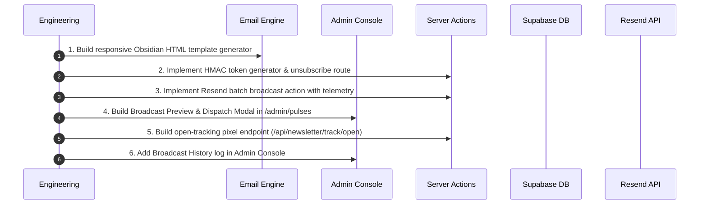

# Implementation Plan: Pillar 2 – One-Click Executive Digest Dispatcher & Retention Engine

> **Sprint Goal:** Transform collected newsletter signups into a recurring, high-converting executive audience by building an internal One-Click Dispatcher inside the Admin Console, powered by Resend batch dispatch, luxury Obsidian/Gold email design, compliant tokenized unsubscribe flows, and telemetry tracking.

---

## 1. Overview & Architectural Blueprint

In the strategic intelligence industry, outbound dispatches are the primary mechanism that transforms passive readers into high-ticket enterprise advisory clients (₦750,000 – ₦5,000,000 retainers).

Currently, visitors can subscribe to the Fozill Global Intelligence Digest, but analysts have no tooling to dispatch published pulses or weekly digests to those subscribers. **Pillar 2 builds this end-to-end retention and broadcast pipeline.**

```
┌─────────────────────────────────────────────────────────────────────────────┐
│                      PILLAR 2 BROADCAST ARCHITECTURE                        │
└──────────────────────────────────────┬──────────────────────────────────────┘
                                       │
                  [Admin Console: /admin/pulses]
                                       │
                   Analyst clicks "Broadcast Issue"
                                       │
                                       ▼
                  [Broadcast Preview & Test Modal]
             (Desktop / Mobile Live Preview + Test Send)
                                       │
                     Analyst Confirms Broadcast
                                       │
                                       ▼
                  [Server Action: app/actions/broadcast.ts]
               - requireAdmin() authentication check
               - Fetch public.newsletter_subscribers (status = 'active')
               - Generate recipient-specific HMAC tokens (Unsubscribe & Open)
               - Render responsive Executive HTML Template
                                       │
                    ┌──────────────────┴──────────────────┐
                    │                                     │
                    ▼                                     ▼
        [Resend Batch API Dispatch]          [Simulated Mode Fallback]
        (resend.batch.send in 100-chunks)    (If API key placeholder)
                    │                                     │
                    └──────────────────┬──────────────────┘
                                       │
                                       ▼
                  [Insert public.newsletter_events]
                  - event_type: 'send'
                  - digest_slug: pulse.slug
                  - metadata: { recipient_count, title, date }
                                       │
        ┌──────────────────────────────┴──────────────────────────────┐
        │                                                             │
        ▼                                                             ▼
[Recipient Opens Email]                                    [Recipient Unsubscribes]
                     Clicks /unsubscribe?token=...
        │                                                             │
        ▼                                                             ▼
Logs 'open' to newsletter_events                           Updates status = 'unsubscribed'
                                                           Logs 'unsubscribe' event
```

---

## 2. Technical Breakdown & Components

### Component 1: Luxury Executive Email Template Generator
**File:** `lib/email/pulse-digest-template.ts`

The email template must feel like a high-grade confidential intelligence memorandum, not a promotional marketing flyer:

* **Visual Identity & Aesthetics:**
  - Background: Obsidian deep canvas (`#0c0e10` / `#121518`)
  - Accent Colors: Intelligence Gold (`#D8A83E`), Subtle Zinc (`#27272a`), Muted Platinum (`#a1a1aa`)
  - Typography: Cross-client serif headers (`Georgia`, `Cambria`, `serif`) and clean monospace labels (`Courier New`, monospace)
* **Structural Layout:**
  1. **Header Emblem:** Fozill Strategic Intelligence wordmark with "CONFIDENTIAL INTELLIGENCE MEMO".
  2. **Issue Header:** Pulse Title, Issue Week / Number, Dispatch Date, and dynamic **Mood Index Gauge** (e.g. `Mood: 58/100 · Critical Volatility`).
  3. **Executive Summary:** Concise 2-paragraph geopolitical & market breakdown.
  4. **Pulse Insights & Key Signals:** Clean card blocks featuring trend indicators (e.g. `↑ 14% Price Sensitivity`), core analytical findings, and strategic implications.
  5. **Gated Teaser:**
     > *"🔒 Strategic response playbooks and attribution graphs are reserved for Enterprise Retainer clients. [Access Full Dossier →]"*
  6. **Call-to-Action:** Direct deep-link to the online portal (`https://fozill.com/indices` or `/signals`).
  7. **Mandatory Compliance Footer:**
     - Registered entity address and dispatch notice.
     - Single-click cryptographically signed unsubscribe URL.
     - Open-tracking 1x1 transparent image pixel.

---

### Component 2: Resend Batch Dispatch Server Actions
**File:** `app/actions/broadcast.ts`

Elevated server-side operations that safely execute broadcasts:

* **`getBroadcastAudienceSummary()`:**
  - Checks `await requireAdmin()`.
  - Queries `newsletter_subscribers` for total count, active count, unsubscribed count, and bounced count.
  - Returns audience health metrics to the admin UI before broadcasting.
* **`sendTestBroadcast({ pulseId, recipientEmail })`:**
  - Checks `await requireAdmin()`.
  - Generates template for the specified pulse and sends a single preview to `recipientEmail`.
  - Appends a prominent `[TEST DISPATCH]` watermark.
* **`broadcastPulseToSubscribers({ pulseId })`:**
  - Checks `await requireAdmin()`.
  - Verifies pulse exists and is marked `status = 'published'`.
  - Pulls all active subscribers (`status = 'active'`).
  - Generates HMAC-signed unsubscribe tokens for each recipient using `AUTH_SECRET || SUPABASE_SERVICE_ROLE_KEY`.
  - Chunks recipients into arrays of 100 (Resend batch limit).
  - If `isResendConfigured`: Calls `resend.batch.send(...)` for each batch.
  - If Resend API key is in placeholder/mock mode: Logs full execution details safely, marks as simulated, and continues pipeline.
  - Records batch dispatch records into `newsletter_events`:
    - `event_type = 'send'`
    - `digest_slug = pulse.slug`
    - `metadata = { pulse_id, pulse_title, total_recipients, timestamp, simulated }`
  - Revalidates admin pulse and subscriber caches.

---

### Component 3: Admin Broadcast Center & Live Preview Modal
**File:** `app/admin/(dash)/pulses/broadcast-modal.tsx`
**Integration:** Inside `app/admin/(dash)/pulses/pulse-manager.tsx`

Adds an executive broadcasting cockpit directly to the Pulse Manager:

* **Trigger Button:** Prominent "Broadcast to Subscribers" button (with Send / Radio icon) on every published pulse card.
* **Modal Cockpit:**
  - **Audience Bar:** Displays live metrics (`e.g. 128 Active Executive Subscribers`).
  - **Multi-View Preview Tabs:**
    - *Desktop View:* Styled email viewport simulator.
    - *Mobile View:* 375px mobile viewport simulator.
    - *Raw HTML / Source:* Code preview with one-click copy.
  - **Test Send Controls:** Quick-test input to send a preview to the admin's personal inbox.
  - **Two-Step Safety Confirmation:** Prevents accidental sends. Requires confirming the recipient count.
  - **Dispatch Progress Indicator:** Animated progress bar showing batch progress (`Batch 1/3 sent... Batch 2/3 sent... Done`).
  - **Success Report:** Displays total sent, delivery time, and link to broadcast audit history.

---

### Component 4: Public Unsubscribe Handler & Dedicated Page
**Files:**
- `app/unsubscribe/page.tsx` (User interface)
- `app/api/newsletter/unsubscribe/route.ts` (API endpoint)
- `lib/email/tokens.ts` (HMAC cryptographic token generation & verification)

Compliance with NDPA (Nigeria Data Protection Act 2023), CAN-SPAM, and GDPR:

* **Cryptographic Token Security:**
  - Tokens are calculated as:
    `hmacSha256(email + ":" + secret, salt)`
  - Prevents attackers from forging unsubscribe links for third-party executive emails.
* **One-Click Unsubscribe Processing:**
  - When the link is opened, status in `newsletter_subscribers` is updated to `unsubscribed`.
  - An `unsubscribe` event is logged to `newsletter_events`.
* **Polished Obsidian Unsubscribe Page:**
  - Minimalist dark aesthetic matching Fozill.
  - Clear confirmation: *"You have been removed from the Fozill Strategic Intelligence Digest."*
  - "Resubscribe" one-click button in case the click was accidental.

---

### Component 5: Open & Click Telemetry Tracking
**File:** `app/api/newsletter/track/open/route.ts`

Invisible telemetry tracking for subscriber engagement:

* **Open-Tracking Pixel:**
  - Endpoint: `GET /api/newsletter/track/open?slug=[slug]&e=[hashed_email]`
  - Immediately streams a 43-byte transparent `image/gif` with `Cache-Control: no-store, no-cache, must-revalidate, proxy-revalidate`.
  - Non-blocking background telemetry recording into `newsletter_events`:
    - `event_type`: `'open'`
    - `digest_slug`: `slug`
    - `metadata`: `{ user_agent, timestamp, client_ip_hash }`
* **Click Attribution:**
  - All outbound links inside the email digest automatically include standard UTM parameters:
    `?utm_source=fozill_digest&utm_medium=email&utm_campaign=[pulse_slug]`

---

### Component 6: Broadcast Audit Log & Telemetry in Admin
**File:** `app/admin/(dash)/pulses/broadcast-history.tsx`
**Integration:** Inside `/admin/pulses` and `/admin/analytics`

Gives analysts full visibility into previous dispatches:

* Lists past dispatches by issue name, date, total recipients, and delivery status.
* Displays open count and calculated open rate based on telemetry in `newsletter_events`.

---

## 3. Database Schema Verification

Pillar 2 relies on tables and policies already deployed in Phase 1 & 2:

| Table | Relevant Columns | RLS Policy Status |
| :--- | :--- | :--- |
| `public.newsletter_subscribers` | `id`, `email`, `status` ('active', 'unsubscribed', 'bounced'), `subscribed_at` | RLS Enabled; public insert only, service_role full access |
| `public.newsletter_events` | `id`, `email`, `event_type` ('send', 'open', 'click', 'subscribe', 'unsubscribe'), `digest_slug`, `metadata`, `occurred_at` | RLS Enabled; public insert allowed (for tracking pixel), service_role full access |
| `public.intelligence_pulses` | `id`, `slug`, `title`, `summary`, `mood_index`, `status`, `published_at` | RLS Enabled; public select on published, service_role full access |
| `public.pulse_items` | `id`, `pulse_id`, `title`, `body`, `signal`, `implication`, `recommendation`, `premium` | RLS Enabled; public select on published items, service_role full access |

*No breaking database migrations are required.*

---

## 4. Implementation Steps & Milestones



### Phase 2.1: Email Template & Token Engine
- [ ] Create `lib/email/tokens.ts` for HMAC token signing and verification.
- [ ] Create `lib/email/pulse-digest-template.ts` with cross-client HTML generation (desktop & mobile tested, table-based structure, inline CSS, Obsidian/Gold styling).

### Phase 2.2: Unsubscribe Route & Landing Page
- [ ] Create `app/api/newsletter/unsubscribe/route.ts` API handler.
- [ ] Create `app/unsubscribe/page.tsx` branded public page with confirmation and one-click undo/resubscribe.

### Phase 2.3: Telemetry Tracking Endpoint
- [ ] Create `app/api/newsletter/track/open/route.ts` delivering transparent 1x1 GIF and logging `open` event to `newsletter_events`.

### Phase 2.4: Broadcast Server Actions & Safety Gates
- [ ] Create `app/actions/broadcast.ts`:
  - `getBroadcastAudienceSummary()`
  - `sendTestBroadcast({ pulseId, testEmail })`
  - `broadcastPulseToSubscribers({ pulseId })`
  - Automatic batching (chunks of 100) and graceful mock fallback.

### Phase 2.5: Admin Broadcast Cockpit & Pulse Manager Integration
- [ ] Create `app/admin/(dash)/pulses/broadcast-modal.tsx`:
  - Live Desktop & Mobile email preview iframe / container.
  - Active subscriber counter.
  - Test-send input & dispatch button.
  - Safety confirmation dialog before mass dispatch.
  - Real-time progress bar.
- [ ] Integrate modal trigger into `app/admin/(dash)/pulses/pulse-manager.tsx`.
- [ ] Add Broadcast History log component to view past dispatches.

---

## 5. Verification & Testing Checklist

1. **Local Test Dispatch:**
   - Open `/admin/pulses`, select a published pulse, click **"Broadcast Issue"**.
   - Verify the email preview renders with proper Obsidian styling, gold badges, and mood index gauge.
   - Send a test email to a designated address and verify delivery and formatting.
2. **Batch Dispatch Verification:**
   - Execute a simulated or live batch broadcast.
   - Verify that all active subscribers receive an entry in `newsletter_events` with `event_type = 'send'`.
   - Verify that inactive/unsubscribed subscribers are excluded.
3. **Unsubscribe Flow Verification:**
   - Click the unsubscribe link in a test email.
   - Verify redirect to `/unsubscribe` with confirmation message.
   - Check database to verify `newsletter_subscribers.status` changed to `'unsubscribed'`.
   - Verify an `'unsubscribe'` event was recorded in `newsletter_events`.
4. **Open Tracking Telemetry:**
   - Trigger the tracking pixel URL in a browser / curl.
   - Verify 200 OK with `image/gif` content-type.
   - Verify an `'open'` event is logged in `newsletter_events`.
5. **Production Build & Typecheck:**
   - Run `npm run build` to confirm zero compilation or TypeScript errors.
   - Commit and push to `origin/master`.
