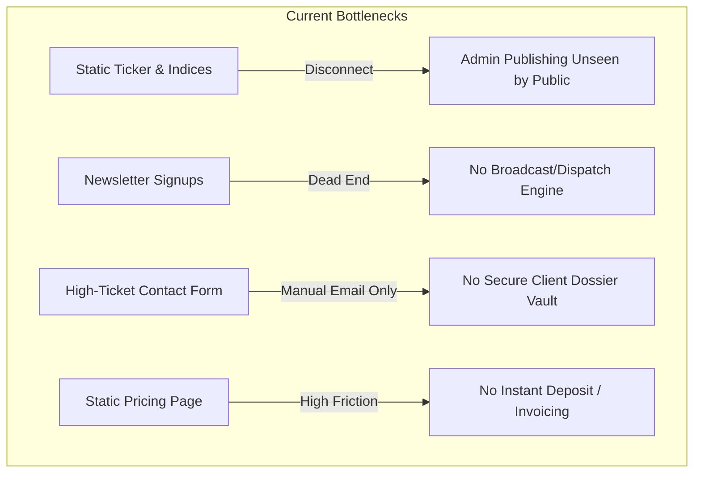
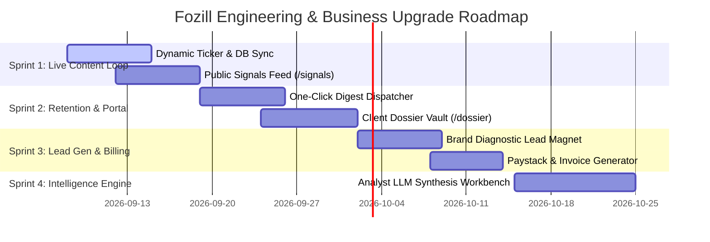

# Fozill Strategic Intelligence: Platform Business Assessment & Product Upgrade Plan

> **Document Version:** 1.0.0  
> **Target Horizon:** Q3 2026 – Q1 2027  
> **Prepared For:** Executive Leadership & Engineering Team  
> **Core Mission:** *"Transform Nigeria's fragmented public signals into high-stakes, subscription-grade strategic intelligence for business, political, and institutional leaders."*

---

## 1. Executive Business Assessment

### 1.1 Commercial Positioning: Escaping the "Scraping Agency" Trap
In the intelligence industry, companies that sell **monitoring or dashboards** (e.g., social listening tools, keyword scrapers) become commodities that compete on price against venture-backed global giants (Brandwatch, Meltwater, Talkwalker). 

Fozill's defensible market positioning is:
> **"We do not sell dashboards. We sell executive answers, early warnings, and strategic prescriptions."**

```
┌───────────────────────────────────────────────────────────────────────────┐
│                           FOZILL PRODUCT SPECTRUM                         │
├────────────────────────────┬──────────────────────────────────────────────┤
│ Commodity (Do NOT build)   │ Proprietary Asset (Fozill's Moat)            │
├────────────────────────────┼──────────────────────────────────────────────┤
│ 50 confusing dashboards    │ 1-page Monday Morning Executive Brief (7 AM) │
│ Raw tweet / post volume    │ Sentiment Shift Velocity (e.g. ↑ 31% / 7d)   │
│ Generic keyword alerts     │ Multilingual & Dialectal NLP (Pidgin/Hausa)  │
│ Unvetted web mentions      │ Entity-Narrative Attribution Graph           │
│ "Figure out what it means" │ "Recommended Strategic Response & Checklist"│
└────────────────────────────┴──────────────────────────────────────────────┘
```

### 1.2 Target Customer Profiles & Willingness to Pay
| Segment | Primary Pain Point | Typical Buyer | Target Retainer / Price |
| :--- | :--- | :--- | :--- |
| **Tier-1 FMCG & Consumer Brands** | Shrinkflation backlash, price-sensitivity, regional distribution boycotts, viral TikTok/X complaints | CMO, Head of Corporate Communications | ₦750,000 – ₦1,500,000 / month |
| **Commercial Banks & FinTechs** | Service downtime resentment, POS dispute narratives, regulatory shifts, competitor traction | Chief Risk Officer, Head of Marketing | ₦1,000,000 – ₦2,500,000 / month |
| **Political Actors & Campaign Desks** (2027 Window) | Regional perception divergence (Kano vs. Lagos), coordinated bot attacks, counter-narrative testing | Campaign Director, Chief of Staff, Senatorial/Gubernatorial Committees | ₦1,500,000 – ₦5,000,000 / month (or ₦2M–₦10M project fee) |
| **Hedge Funds, PE & Macro Investors** | FX policy reactions, inflation sentiment, consumer purchasing power trends | Managing Director, Research Lead | $2,500 – $6,000 / month (USD) |

---

## 2. Current Platform Gap Analysis

Our source code inspection reveals a high-polish brand identity and solid Next.js/Supabase foundation, but identifies **six critical business & architectural gaps** that currently limit client conversion and monetization:



1. **Content Disconnect (Admin vs. Public):**
   - The admin console allows drafting and publishing `intelligence_signals` and `intelligence_pulses`.
   - However, the public homepage ticker and `/indices` page display **hardcoded static mock data**. When an analyst publishes an urgent signal in the admin dashboard, visitors cannot see it.
2. **Missing Broadcast & Retention Engine:**
   - Subscribers submit their emails to `newsletter_subscribers`, but there is no mechanism in `/admin` to compose, preview, and dispatch weekly intelligence briefs to the subscriber list via Resend.
3. **No Interactive Client Dossier Delivery:**
   - Paying enterprise clients who commission a ₦1.5M report currently have no private portal or passwordless token URL to interact with their bespoke dossiers, view regional heatmaps, or download formatted executive PDFs.
4. **Friction-Heavy Conversion:**
   - The website relies entirely on an 8-field consultation form. There is no lightweight, high-converting **"Diagnostic Lead Magnet"** (e.g. *Enter your brand to receive an instant 3-signal teaser audit*).
5. **Lack of Invoicing & Retainer Billing:**
   - No payment checkout (Paystack for Naira, Stripe for USD) or structured invoice generation for corporate purchase orders.
6. **No Analyst Synthesis Tooling:**
   - Analysts currently have no internal workflow tool to ingest raw links/tweets and run LLM-assisted structured extraction into the Fozill dossier schema.

---

## 3. The 6-Pillar Platform Upgrade Plan

```
┌─────────────────────────────────────────────────────────────────────────────┐
│                          FOZILL UPGRADE BLUEPRINT                           │
├───────────────────────┬─────────────────────────┬───────────────────────────┤
│ PILLAR 1              │ PILLAR 2                │ PILLAR 3                  │
│ Dynamic Signal Feed   │ One-Click Intelligence  │ Secure Client Vault       │
│ & Live Ticker Sync    │ Dispatcher (Resend)     │ & Dossier Exporter        │
├───────────────────────┼─────────────────────────┼───────────────────────────┤
│ PILLAR 4              │ PILLAR 5                │ PILLAR 6                  │
│ Brand Diagnostic      │ Analyst LLM Synthesis   │ Retainer Billing          │
│ Lead Magnet Engine    │ Workbench               │ (Paystack & Automated PO) │
└───────────────────────┴─────────────────────────┴───────────────────────────┘
```

---

### Pillar 1: Dynamic Signal Feed & Live Public Sync

**Business Objective:** Prove platform activity and analytical velocity in real-time to prospective enterprise buyers.

#### Technical Specifications
* **Connect Homepage Ticker:** Update `components/hero/signal-ticker.tsx` to fetch the 10 most recent published signals (`status = 'published'`) from `intelligence_signals` using Supabase ISR (Incremental Static Regeneration, `revalidate = 300`). Fall back seamlessly to curated defaults if table is empty.
* **Public Live Signal Stream (`/signals`):**
  - Create a public timeline of macro signals filtered by category (`Business`, `Political`, `Economic`, `Sector`, `Crisis`).
  - Signal cards display: Category chip, Direction icon, Geopolitical zone, Confidence rating, Summary headline, and a gated teaser for the strategic recommendation:
    > *"🔒 Strategic recommendation and attribution data reserved for Enterprise Retainer clients. [Unlock Full Brief →]"*
* **Live Market Sentiment Badge:** Expose the latest published Fozill Pulse mood index (0–100) dynamically in the navigation bar.

---

### Pillar 2: One-Click Executive Digest Dispatcher

**Business Objective:** Turn collected newsletter emails into a compounding, recurring audience that converts into high-ticket inbound briefs.

#### Technical Specifications
* **Admin Dispatch Center (`/admin/pulses/[id]/broadcast`):**
  - Add a **"Preview & Broadcast to Subscribers"** modal inside the Pulse Manager.
  - Generates a mobile-optimized HTML template matching Fozill's visual design (Obsidian `#111315` canvas, Intelligence Gold `#D8A83E` accents, editorial serif body).
  - Integrates with the Resend Batch API (`resend.batch.send`) to broadcast to all `active` subscribers in `newsletter_subscribers`.
* **Automatic Event Telemetry:**
  - Injects tracking pixels and unsubscribe headers into outbound emails.
  - Automatically logs `open`, `click`, and `unsubscribe` events into `newsletter_events` to calculate audience engagement score inside `/admin/analytics`.

---

### Pillar 3: Secure Client Dossier Vault (`/dossier/[token]`)

**Business Objective:** Deliver an elite, high-touch unboxing experience for enterprise clients paying ₦500k–₦3M per report, increasing contract renewal rates.

#### Technical Specifications
* **Tokenized Access URLs:**
  - Deliver confidential client dossiers via cryptographically secure UUID tokens (e.g. `fozill.com/dossier/3f8a9e...`) with optional client-side passphrase protection.
* **Interactive Dossier View:**
  - Executive Briefing Tab: Executive summary, health score meter, velocity indicator.
  - Regional Heatmap Tab: North-West, North-East, North-Central, South-West, South-East, South-South sentiment breakdown.
  - Narrative Attribution Matrix: Originating sources, top influencers, bot probability.
  - Strategic Action Checklist: Interactive checkboxes for leadership teams to track execution.
* **One-Click Executive PDF Export:**
  - Client-side or serverless PDF compilation (using `@react-pdf/renderer` or Puppeteer) formatted as a redacted confidential intelligence report with client watermarks.

---

### Pillar 4: "Brand Radar" Interactive Lead Diagnostic

**Business Objective:** Lower top-of-funnel friction and generate 10x more qualified corporate and political leads.

#### Technical Specifications
* **Diagnostic Page (`/audit` or `/radar`):**
  - Single input: *"Enter your company, brand, or candidate name."*
  - Instant preliminary evaluation engine: Simulates sentiment analysis across 4 categories (Brand Defense, Public Pressure, Competitor Momentum, Regional Visibility).
  - Displays a redacted score breakdown (Teaser: *Overall Perception: 58/100 • 2 Emerging Narrative Risks Detected*).
  - Gated CTA: *"Enter your corporate email to receive the complete 6-page preliminary intelligence diagnostic in your inbox."*
  - Automatically pipes the lead into `brief_requests` with tag `diagnostic_audit` and alerts the founder.

---

### Pillar 5: Analyst LLM Synthesis Workbench (`/admin/workbench`)

**Business Objective:** Accelerate brief production time from 48 hours to 2 hours per analyst, enabling lean delivery of high-margin retainers.

#### Technical Specifications
* **Raw Ingestion Input:**
  - Analysts paste raw text, news article transcripts, speech excerpts, or social media conversation threads.
* **LLM Extraction Pipeline:**
  - Leverages Google Gemini 2.5 Flash / Pro API to structure unorganized text into Fozill's schema:
    ```typescript
    interface DossierSchema {
      executiveSummary: string;
      sentimentScore: number;
      dominantNarratives: { name: string; traction: number; sentiment: string }[];
      regionalDistribution: { zone: string; score: number; narrative: string }[];
      actionablePrescription: string[];
    }
    ```
* **One-Click Draft Signal / Pulse Creation:**
  - The analyst reviews and edits the AI-extracted output, then clicks *"Export to Pulse"* or *"Publish Signal"*.

---

### Pillar 6: Invoicing & Retainer Billing Infrastructure

**Business Objective:** Remove payment friction and collect retainer deposits upfront.

#### Technical Specifications
* **Paystack Integration (Naira Retainers):**
  - Direct checkout on `/pricing` for Tier 1 Emergency Reports (₦500,000) and initial retainer onboarding deposits (₦250,000).
  - Webhook endpoint (`/api/webhooks/paystack`) verifying payment signatures and automatically generating an active client vault.
* **Corporate Invoice & PO Generator:**
  - Button on `/pricing`: *"Generate Corporate Purchase Order / Bank Transfer Invoice"*.
  - Generates an official downloadable PDF Pro-Forma Invoice with Fozill corporate banking details, Tax ID, and milestone terms.

---

## 4. Phased Implementation Roadmap



### Sprint 1 (Week 1–2): Dynamic Content & Public Signal Sync
- [ ] Connect `SignalTicker` to `intelligence_signals` in Supabase with fallback.
- [ ] Build `/signals` page with search and category filtering.
- [ ] Connect `/indices` to published `intelligence_pulses`.

### Sprint 2 (Week 3–4): Retention Engine & Client Dossier Vault
- [ ] Build newsletter broadcast UI in `/admin/pulses`.
- [ ] Implement Resend batch sending with open/click tracking.
- [ ] Build `/dossier/[token]` client view with exportable PDF summary.

### Sprint 3 (Week 5–6): High-Converting Lead Magnet & Checkout
- [ ] Launch `/audit` interactive brand diagnostic.
- [ ] Implement Paystack checkout for Tier 1 emergency briefs.
- [ ] Add automated corporate invoice generator for enterprise purchase orders.

### Sprint 4 (Week 7–8): Analyst AI Workbench & Operational Scaling
- [ ] Build `/admin/workbench` for Gemini-assisted dossier drafting.
- [ ] Implement entity resolution and narrative tagger.
- [ ] Formalize NDPA compliance filing with a registered DPCO in Nigeria.

---

## 5. Target Business KPIs & Financial Milestones

| Metric | Month 1 Target | Month 3 Target | Month 6 Target |
| :--- | :--- | :--- | :--- |
| **Executive Newsletter Subscribers** | 250 | 1,500 | 5,000+ |
| **Weekly Open Rate** | > 45% | > 40% | > 38% |
| **Inbound Brief Requests / Month** | 5 | 18 | 40+ |
| **Active Enterprise Retainers** | 2 (₦1.5M MRR) | 6 (₦5.0M MRR) | 15 (₦15.0M+ MRR) |
| **Emergency Ad-Hoc Reports** | 2 (₦1.0M) | 5 (₦3.5M) | 10 (₦8.0M) |
| **Total Monthly Revenue** | **₦2,500,000** | **₦8,500,000** | **₦23,000,000+** |

---

## 6. Executive Action Summary

To execute this strategy:
1. **Approve Sprint 1 Implementation:** Authorize dynamic synchronization between the database and the public ticker/signals feed.
2. **Commit the Plan:** Maintain this roadmap file in Git to track engineering milestones and commercial deliverables.
3. **Conduct First 5 Manual Client Pitches:** Use the sample dossiers currently in the platform to close the first 3 retainers before building automated scrapers.
